[Retour](../../)

## README par défaut de Drupal

=> [Default_README_of_drupal.txt](Default_README_of_drupal.txt)

## Recherches conceptions et modèles de modules Drupal 8

### Aide de création

- [Custom Plugin Type In Drupal 8](https://uditrawat.medium.com/custom-plugin-type-in-drupal-8-5c243b4ed152)

### Dépôt existant - Github

#### Recherches

[Drupal 8 plugin](https://github.com/search?l=PHP&q=drupal+8+plugins&type=Repositories)

#### Hooke Manager

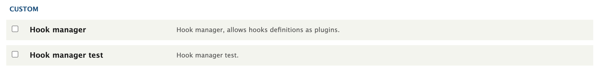

[Olexyy/hook_manager](https://github.com/Olexyy/hook_manager)

#### Payement Datatrans

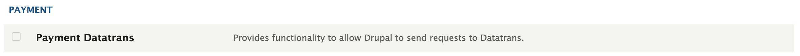

[md-systems/datatrans](https://github.com/md-systems/datatrans)

#### Breakfast

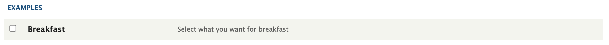

[drupal8book/breakfast](https://github.com/drupal8book/breakfast)

#### Demo

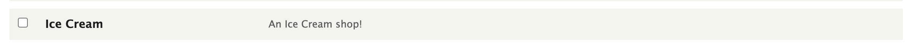

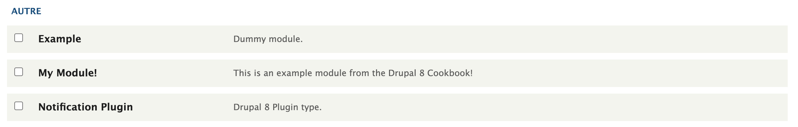

[phadnisanand/plugin_demo](https://github.com/phadnisanand/plugin_demo)

Modules :

- My module
- Ice Cream

#### Notification

Modules :

- Example
- Notification

[thanosapps/notification_plugin](https://github.com/thanosapps/notification_plugin)

---

#### Saferpay

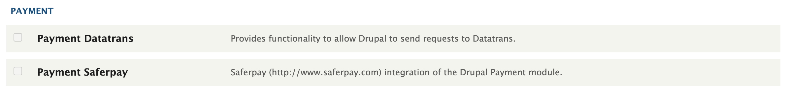

[md-systems/saferpay](https://github.com/md-systems/saferpay)

#### Kaltura

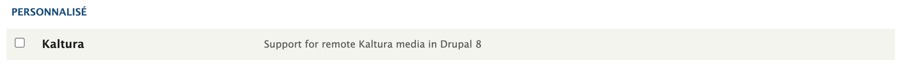

[AtticusRoberts/kaltura](https://github.com/AtticusRoberts/kaltura)

#### Products

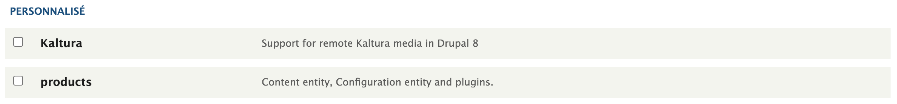

[vacho/products](https://github.com/vacho/products)

---

#### Products

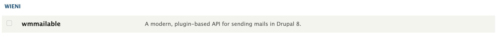

[wieni/wmmailable](https://github.com/wieni/wmmailable)

#### Products

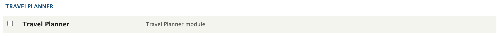

[tgillstar/travel_planner](https://github.com/tgillstar/travel_planner)

#### Products

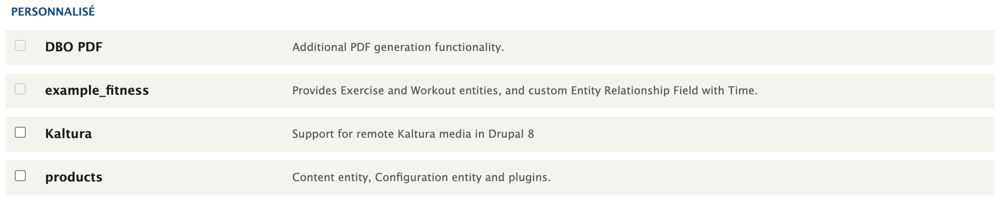

[jcandan/example_fitness](https://github.com/jcandan/example_fitness)

[davez1000/dbo_pdf](https://github.com/davez1000/dbo_pdf)

#### Products

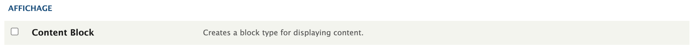

[Jaesin/content_block](https://github.com/Jaesin/content_block)